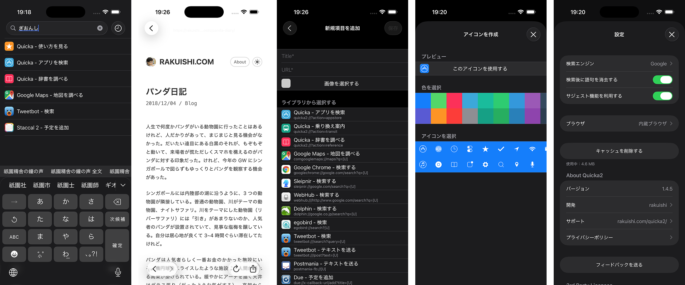

# Quicka2 - 検索を快適に

> Quicka2 は、素早く快適に検索を行うためのアプリです。   
> 起動するとキーボードが自動で立ち上がり、どのアプリよりもスムーズに快適に検索を行うことができます。  
> このアプリを一度使って検索すると、この快適さが当たり前になります。

## License

 この 作品 は <a rel="license" href="http://creativecommons.org/licenses/by-nc-nd/4.0/">クリエイティブ・コモンズ 表示 - 非営利 - 改変禁止 4.0 国際 ライセンス</a>の下に提供されています。
